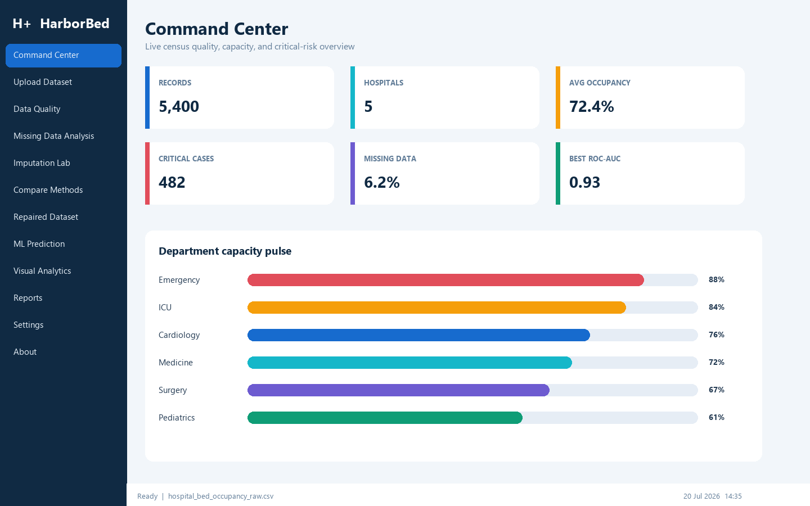
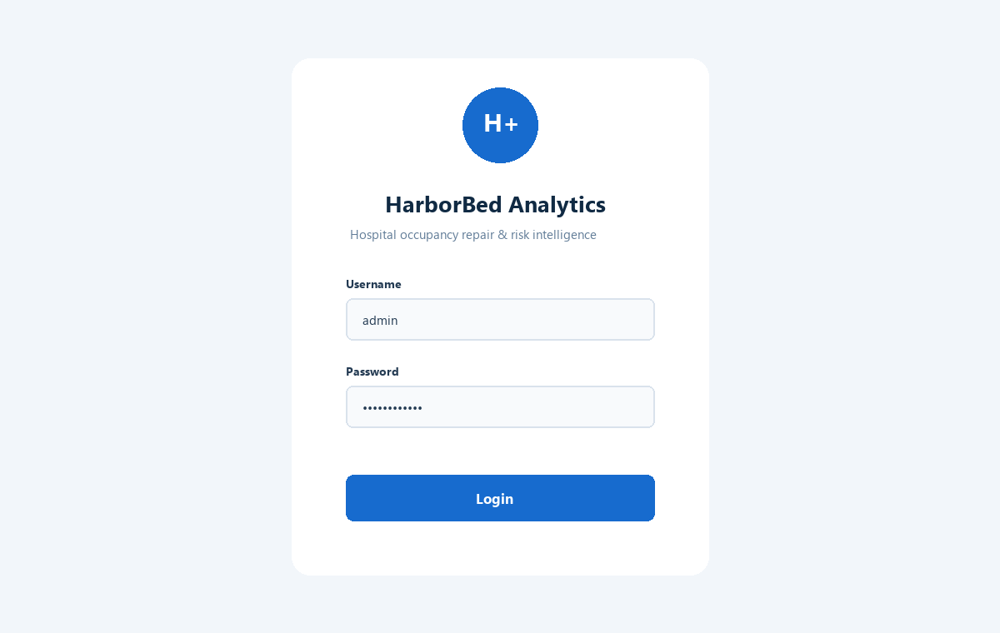

# Hospital Bed Occupancy Missing-Data Repair

**Project ID:** Mtech-DS26004  
**Student:** Ahmed Masood  
**Version:** 1.0.0  
**Primary interface:** Tkinter  
**Python:** 3.10+

An advanced, reproducible data science project for detecting, benchmarking, repairing, and explaining irregular missing values in hospital census data. It includes a modern desktop command center, 15 imputation strategies, per-column repeated-mask selection, leakage-safe critical-occupancy modeling, high-resolution charts, an executed Jupyter notebook, and a professional PDF report.

> Educational decision-support prototype using synthetic data. It is not a medical device and must not be used for clinical decisions without governed local validation.



## Problem statement

Hospital capacity records can be incomplete because of delayed data entry, sensor failure, missing discharge updates, synchronization errors, irregular reporting, or manual mistakes. A convenient imputer may reduce missing counts while shifting averages, suppressing variance, breaking correlations, or hiding operational risk. This project evaluates repair accuracy against artificially hidden known values before recommending a strategy for each numerical field.

## Objectives

- Generate realistic multi-hospital census data with meaningful operational constraints.
- Represent MCAR, MAR, MNAR, sequential, departmental, block, weekend, and holiday missingness.
- Validate identifiers, dates, domains, capacity constraints, staffing, balances, and outliers.
- Compare 15 imputation strategies through repeated masking and bias-aware metrics.
- Engineer past-only operational, lag, rolling, and pressure features.
- Compare seven classifiers for critical occupancy while excluding target leakage.
- Provide an administrator-quality Tkinter workflow, executable notebook, tests, charts, and PDF report.

## Key features

- 5,400 deterministic hospital-department-day records across five hospitals and six departments.
- Mean, median, mode, forward/back fill, linear/time/polynomial interpolation, KNN, iterative, department mean, hospital median, seasonal, rolling median, and hybrid imputation.
- MAE, RMSE, MSE, R2, MAPE, median absolute error, bias, percentage bias, variance/SD distortion, KS statistic, Wasserstein distance, distribution similarity, correlation preservation, and runtime.
- Per-column weighted scoring: 34% RMSE, 18% MAE, 14% absolute bias, 12% KS, 8% variance distortion, 8% correlation loss, and 6% runtime.
- Logistic regression, decision tree, random forest, gradient boosting, XGBoost, SVM, and KNN support.
- Recall-first model selection: `0.60 * recall + 0.40 * ROC-AUC`, with a configurable 0.42 alert threshold.
- Hashed SQLite demo login using salted PBKDF2-HMAC-SHA256.
- Responsive sidebar, reusable components, scrollbars, sortable Treeviews, progress bars, threaded long tasks, settings, logging, exceptions, exports, and timestamp status bar.

## Dataset

The raw CSV includes identifiers, dates, hospital attributes, city, department, ward, total/occupied/available/reserved/emergency/ICU beds, ventilators, admissions, discharges, emergency cases, staffing, length of stay, turnover, occupancy, mortality, infection, calendar flags, season, temperature, and outbreak state. Occupied beds are capped by total beds; ICU occupancy is capped by ICU capacity; available beds use the bed-balance equation; outbreaks increase demand; and weekends/holidays reduce staffing.

## GUI screenshots

| Login | Dashboard |
|---|---|
|  |  |

## Folder structure

```text
Mtech-DS26004_Hospital_Bed_Occupancy/
├── app.py                       # Tkinter launcher
├── main.py                      # argparse lifecycle CLI
├── requirements.txt
├── README.md
├── LICENSE
├── .gitignore
├── config/                      # Application, imputation, and model policies
├── data/
│   ├── raw/                     # Generated irregular census CSV
│   ├── processed/               # Clean, repaired, and engineered CSVs
│   └── validation/              # Artificially masked ground-truth set
├── notebooks/                   # Executed full analytical notebook
├── models/                      # Model, preprocessor, imputation policy, features
├── src/                         # Modular data science implementation
├── gui/                         # One OOP class per requested screen
├── database/                    # Hashed local demo credentials
├── outputs/
│   ├── charts/                  # High-resolution evidence
│   ├── reports/                 # PDF, quality, statistical, and model reports
│   ├── predictions/
│   ├── experiments/             # Repeated runs, comparisons, and experiment log
│   └── screenshots/
├── tests/                       # unittest suite
└── presentation/                # Video script, outline, and demo steps
```

## Installation

### Windows PowerShell

```powershell
git clone https://github.com/your-username/Mtech-DS26004-Hospital-Bed-Occupancy.git
cd Mtech-DS26004-Hospital-Bed-Occupancy
py -3.10 -m venv .venv
.\.venv\Scripts\Activate.ps1
python -m pip install --upgrade pip
pip install -r requirements.txt
```

If PowerShell blocks activation, run `Set-ExecutionPolicy -Scope Process Bypass` in that terminal only, then activate again.

### macOS/Linux

```bash
python3.10 -m venv .venv
source .venv/bin/activate
python -m pip install --upgrade pip
pip install -r requirements.txt
```

Tkinter ships with standard Windows/macOS Python. On Ubuntu/Debian, install it with `sudo apt-get install python3-tk`.

## VS Code setup

1. Open this repository folder in VS Code.
2. Install the Python and Jupyter extensions from Microsoft.
3. Press `Ctrl+Shift+P`, choose **Python: Select Interpreter**, and select `.venv`.
4. Open the notebook and select the same `.venv` kernel.
5. Run commands from the integrated terminal at the repository root.

## Commands

```bash
# Generate the 5,400-row raw dataset
python main.py --generate-data

# Validate and export outputs/reports/data_quality_report.json
python main.py --validate-data

# Export EDA charts
python main.py --run-eda

# Quick repeated-mask benchmark; add --full for all columns/methods/seeds
python main.py --benchmark-imputation

# Create repaired and feature-engineered datasets
python main.py --engineer-features

# Compare/train models; add --full for all seven families
python main.py --train-model

# Generate the ReportLab PDF
python main.py --generate-report

# Rebuild the entire shipped artifact set
python main.py --run-all

# Launch the desktop application
python app.py

# Launch JupyterLab
jupyter lab notebooks/Mtech_DS26004_full_analysis.ipynb

# Execute notebook top-to-bottom
jupyter nbconvert --execute --to notebook --inplace notebooks/Mtech_DS26004_full_analysis.ipynb

# Run the test suite
python -m unittest discover tests
```

## Demo login

- Username: `admin`
- Password: `Hospital@123`

The password is never stored as plaintext. At first launch, `database/users.db` stores a random salt and a 240,000-iteration PBKDF2 hash.

## Imputation methods

The GUI exposes all 15 methods. `hybrid` examines data type, missing percentage, skewness, time behavior, grouping availability, and cross-column correlation. For final repair, benchmark rank can override its heuristic. Artificial masking starts from observed values, hides a configurable fraction with multiple seeds, and compares estimates with saved ground truth.

## Machine learning

The target is `critical_occupancy_flag`, defined as occupancy rate >=90%. Stratified train, validation, and test splits are used. Numeric fields receive median imputation plus missing indicators and standardization; categoricals receive most-frequent repair and unknown-safe one-hot encoding. Direct threshold ingredients, derived flags, and current-row patient-ratio features built from occupied beds are excluded from predictors. Metrics include accuracy, precision, sensitivity, specificity, F1, ROC-AUC, PR-AUC, balanced accuracy, MCC, log loss, Brier score, confusion matrix, and calibration.

## GitHub upload

```bash
git init
git add .
git commit -m "Complete Mtech-DS26004 hospital occupancy project"
git branch -M main
git remote add origin https://github.com/YOUR_USERNAME/Mtech-DS26004-Hospital-Bed-Occupancy.git
git push -u origin main
```

Before pushing, replace the repository placeholder in `gui/about_page.py` and this README. GitHub may warn about generated model size; Git LFS is appropriate if a future model exceeds GitHub's file limit.

## Common errors

- **`python` not found:** install Python 3.10+ and enable **Add Python to PATH**, or use the Windows `py` launcher.
- **Tkinter missing:** reinstall standard Python with Tcl/Tk selected; Linux users need `python3-tk`.
- **XGBoost import error:** run `pip install --upgrade "xgboost>=2.1,<4"`; the module has a gradient-boosting fallback for training.
- **SHAP/NumPy binary error:** recreate the environment and install only from `requirements.txt`.
- **PowerShell activation blocked:** `Set-ExecutionPolicy -Scope Process Bypass`.
- **Notebook cannot import `src`:** launch Jupyter from the repository root.
- **PDF text or charts missing:** run `python main.py --run-eda` before `--generate-report`.
- **Slow full benchmark:** omit `--full` for the portfolio fast mode; KNN and iterative repair are intentionally expensive.
- **GUI looks scaled on Windows:** set display scaling to 100-150% and restart the app; it remains resizable down to 1080x700.

## Limitations

- Synthetic data may not represent every hospital.
- MNAR values are difficult to recover accurately from observed data.
- Imputation cannot replace proper data collection.
- KNN and iterative methods may be computationally expensive.
- Time-series interpolation can fail during long gaps.
- Model performance depends on input quality and operating drift.
- Critical thresholds vary by hospital and require governance.

## Future improvements

- External validation on governed, de-identified real hospital data.
- Temporal cross-validation and probability uncertainty intervals.
- Drift, missingness, and subgroup monitoring.
- Hospital-specific thresholds and capacity-cost optimization.
- Role-based access, encrypted audit logs, and database-backed projects.
- Human-review queues for MNAR indicators and long sequential gaps.

## Author

Ahmed Masood  
Mtech-DS26004  
Hospital Bed Occupancy Missing-Data Repair  
Portfolio and academic submission, 2026
